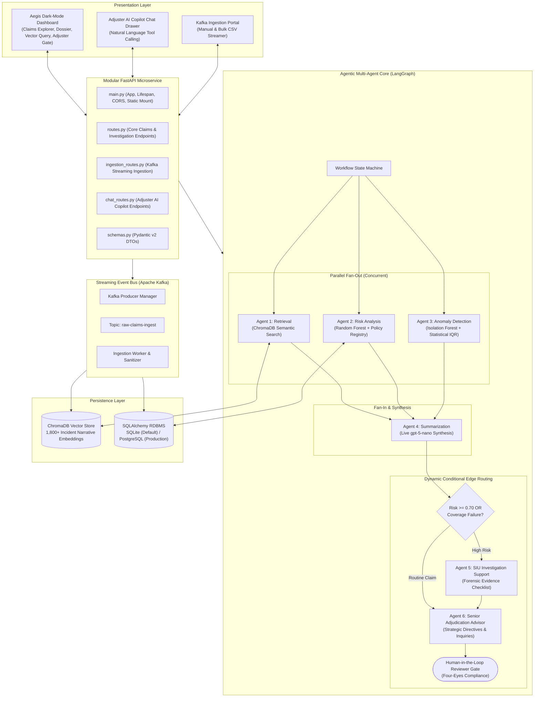

# Aegis: AI-Powered Insurance Claims Intelligence Assistant

[](https://fastapi.tiangolo.com)
[](https://github.com/langchain-ai/langgraph)
[](https://www.trychroma.com)
[](https://scikit-learn.org)
[](https://kafka.apache.org/)
[](https://reactjs.org/)
[](https://www.python.org/)
[](https://www.postgresql.org/)

**Aegis** is an enterprise-grade AI-powered claims adjudication and forensic intelligence platform. Grounded in the real-world **COIL 2000 Insurance Benchmark**, Aegis blends deterministic machine learning, high-dimensional vector search, real-time Apache Kafka streaming ingestion, a stateful **6-agent LangGraph workflow**, an **Adjuster AI Copilot Chatbot**, and human-in-the-loop decision governance.

---

## 📚 Task 5 Documentation Suite

All detailed architectural specifications, user manuals, and presentation guides are available in [`task5_documentation/`](file:///c:/Users/Administrator/Desktop/Capstone/Capstone/task5_documentation):
- 📘 [**USER_GUIDE_AND_EXECUTION.md**](file:///c:/Users/Administrator/Desktop/Capstone/Capstone/task5_documentation/USER_GUIDE_AND_EXECUTION.md) — Complete setup guide, feature inventory, step-by-step run instructions, REST API reference, and troubleshooting.
- 📐 [**ARCHITECTURE.md**](file:///c:/Users/Administrator/Desktop/Capstone/Capstone/task5_documentation/ARCHITECTURE.md) — Full technical architecture, multi-agent sequence diagrams, database schemas, Kafka streaming, and trade-off rationales.
- 🎤 [**PRESENTATION_GUIDE.md**](file:///c:/Users/Administrator/Desktop/Capstone/Capstone/task5_documentation/PRESENTATION_GUIDE.md) — 10-minute executive pitch script (8-min demo + 2-min Q&A defense).
- 📊 [**EVALUATION_REPORT.md**](file:///c:/Users/Administrator/Desktop/Capstone/Capstone/task4_evaluation_and_ui/EVALUATION_REPORT.md) — Objective evaluation benchmark across all 5 PRD evaluation dimensions.

---

## 🚀 Key Highlights & Verification Benchmarks

| Evaluation Dimension | Metric | Aegis Result | PRD Benchmark |
| :--- | :--- | :--- | :--- |
| **Criteria 1: Vector Retrieval** | Hit Rate @ 1 / @ 3 / @ 5 | **100.0% / 100.0% / 100.0%** | > 80% |
| | Mean Reciprocal Rank (MRR) | **1.0000** | > 0.85 |
| **Criteria 2: Risk & Anomaly Detection** | Supervised Model ROC-AUC | **0.9467** | > 0.85 |
| | Overall Test Accuracy | **87.50%** | > 85% |
| | Anomaly Detection Specificity | **90.24%** | > 85% |
| **Criteria 3: Summarization & Grounding** | Factual Grounding Accuracy | **100.0%** | > 95% |
| | Zero-Hallucination Rate | **100.0%** | 100% |
| **Criteria 4: NL Query Intent** | Top-1 Category Accuracy | **100.0%** | > 90% |
| **Criteria 5: Workflow Latency** | Average End-to-End Latency | **13.52s** | Real-time AI |

---

## 🏛️ System Architecture



---

## 📂 Repository Structure

```
Capstone/
├── main.py                         # Central FastAPI application & lifespan manager
├── routes.py                       # Core claims, investigation & search REST endpoints
├── ingestion_routes.py             # Kafka streaming & CSV bulk upload REST endpoints
├── chat_routes.py                  # Adjuster AI Copilot Chatbot REST endpoints
├── chatbot_engine.py               # Universal 4-tool conversational LLM engine
├── database.py                     # SQLAlchemy engine, sessionmaker & auto-seeding
├── models.py                       # SQLAlchemy ORM relational models
├── schemas.py                      # Pydantic v2 data transfer objects (DTOs)
├── server.py                       # CLI execution runner alias
├── docker-compose.yml              # Production PostgreSQL & pgAdmin services
├── requirements.txt                # Python dependencies
├── .env                            # Environment variables (API Key, Base URL, Database)
│
├── task1_data_preparation/         # Task 1: 9,822 COIL profiles, 1,800 grounded claims
│   ├── prepare_data.py             # Data decoding & synthetic generation engine
│   ├── data_sanitizer.py           # Real-time data validation and schema repair
│   ├── kafka_service.py            # Kafka producer manager & buffer
│   ├── streaming_worker.py         # Asynchronous Kafka ingestion worker
│   └── processed_data/             # Processed datasets (clean & ground truth)
│
├── task2_models_analytics/         # Task 2: Predictive analytics & vector storage
│   ├── train_models.py             # Random Forest & Isolation Forest training
│   ├── build_vector_store.py       # ChromaDB dense vector indexing script
│   ├── test_models.py              # ML model unit test suite
│   ├── models/                     # claims_risk_engine.py, claims_vector_engine.py
│   └── vector_store/               # ChromaDB dense persistent vector index
│
├── task3_multi_agent_system/       # Task 3: LangGraph 6-Agent Architecture
│   ├── graph.py                    # StateGraph with parallel fan-out & dynamic handoffs
│   ├── state.py                    # TypedDict shared state definition
│   ├── llm_client.py               # Resilient gpt-5-nano client wrapper
│   ├── test_multi_agent.py         # Multi-agent CLI simulation runner
│   └── agents/                     # 6 specialized agent implementations:
│       ├── retrieval_agent.py      # Agent 1: ChromaDB Dense Vector Search
│       ├── risk_analysis_agent.py  # Agent 2: Supervised Random Forest Classifier
│       ├── anomaly_agent.py        # Agent 3: Unsupervised Isolation Forest Detector
│       ├── summarization_agent.py  # Agent 4: Live gpt-5-nano Executive Brief
│       ├── investigation_agent.py  # Agent 5: SIU Forensic Evidence Checklist
│       └── advisor_agent.py        # Agent 6: Senior Adjudication Advisor Copilot
│
├── task4_evaluation_and_ui/        # Task 4: Automated evaluation & interactive UI
│   ├── evaluate_system.py          # Automated 5-criteria benchmark suite
│   ├── test_api_endpoints.py       # Comprehensive endpoint integration test
│   ├── evaluation_report.json      # Raw evaluation benchmark outputs
│   ├── EVALUATION_REPORT.md        # Detailed evaluation markdown report
│   └── static/                     # Built frontend assets (HTML/CSS/JS)
│
├── task5_documentation/            # Task 5: System documentation & architecture
│   ├── USER_GUIDE_AND_EXECUTION.md # Complete manual, feature catalog & API reference
│   ├── ARCHITECTURE.md             # Full technical architecture specification
│   ├── PRESENTATION_GUIDE.md       # 10-minute executive presentation & demo script
│   └── Project_10_*.pdf            # Original project requirement specification
│
└── frontend/                       # React / Vite / Tailwind UI source components
```

---

## ⚡ Quickstart: How to Run the Project

### 1. Prerequisites
- Python 3.10+
- (Optional) Node.js 18+ for compiling React frontend
- (Optional) Docker for PostgreSQL & Apache Kafka

### 2. Install Dependencies
```powershell
# Create and activate virtual environment
python -m venv venv
.\venv\Scripts\activate

# Install Python requirements
pip install -r requirements.txt
```

### 3. Configure `.env`
Ensure `.env` in the root folder contains:
```ini
OPENAI_API_KEY=your_api_key_here
OPENAI_BASE_URL=https://api.aicredits.in/v1
MODEL_NAME=gpt-5-nano
DATABASE_URL=sqlite:///./insurance.db
KAFKA_BOOTSTRAP_SERVERS=localhost:9092
```

### 4. Start the Application Server
```powershell
python server.py
# or
uvicorn main:app --host 127.0.0.1 --port 8000 --reload
```

Open your browser to:
- 🌐 **Claims Explorer & Live Dossier**: [http://127.0.0.1:8000/](http://127.0.0.1:8000/)
- 🔍 **ChromaDB Semantic Vector Search**: [http://127.0.0.1:8000/search](http://127.0.0.1:8000/search)
- 📥 **Kafka Ingestion & Sanitation Portal**: [http://127.0.0.1:8000/ingest](http://127.0.0.1:8000/ingest)
- 💬 **Adjuster AI Copilot Chatbot**: [http://127.0.0.1:8000/chat](http://127.0.0.1:8000/chat)
- 📖 **Interactive Swagger / OpenAPI Docs**: [http://127.0.0.1:8000/docs](http://127.0.0.1:8000/docs)

---

## 🧪 Running Verification & Test Suites

```powershell
# 1. Run Automated 5-Criteria Benchmark Evaluation Suite
python task4_evaluation_and_ui/evaluate_system.py

# 2. Run REST API Endpoint Integration Tests
python task4_evaluation_and_ui/test_api_endpoints.py

# 3. Run Standalone LangGraph Multi-Agent CLI Simulation
python task3_multi_agent_system/test_multi_agent.py

# 4. Run Scikit-Learn Model Unit Tests
python task2_models_analytics/test_models.py
```

---

## 🛡️ Human-in-the-Loop Governance ("Four-Eyes Principle")

In compliance with insurance regulatory guidelines, AI systems cannot autonomously approve indemnity disbursements:
- **Routine Claims (Risk < 70%)**: The system automatically verifies coverage, benchmarks against historical payouts, marks the claim `Auto-Cleared`, and provides structured fast-track recommendations.
- **High-Risk Claims (Risk >= 70% or Coverage Mismatch)**: The system triggers an autonomous handoff to the SIU Support Agent and Senior Advisor, compiling an evidentiary checklist and recommended inquiry questions.
- **Final Adjudication**: Authorized human adjusters make the final sign-off with audit logging.
