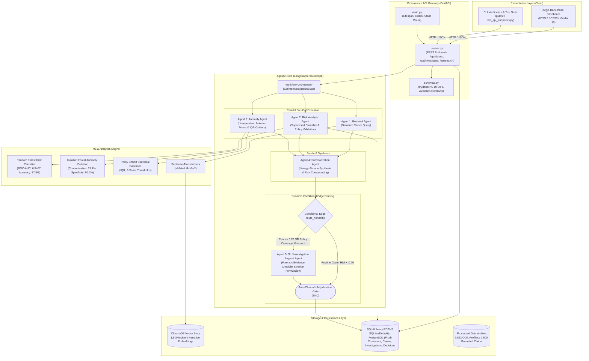
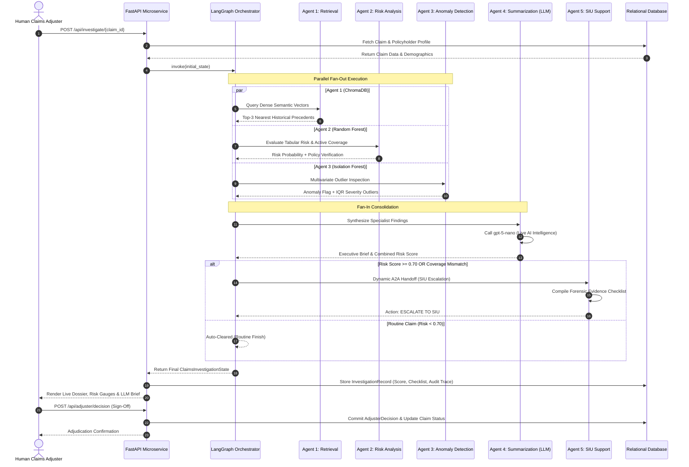
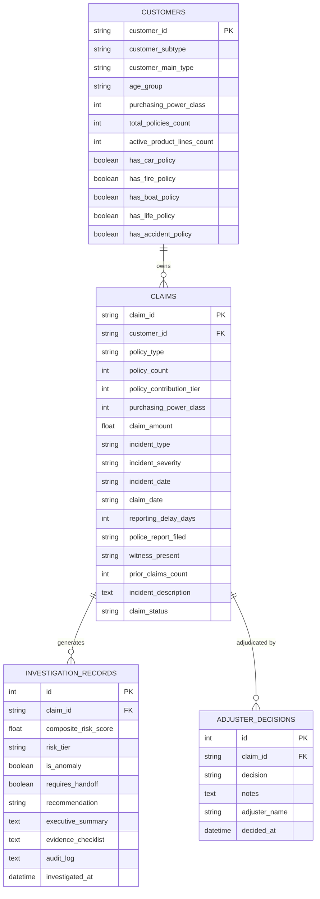

# Aegis System Architecture & Technical Specification

## 1. Executive System Overview

**Aegis** is an enterprise-grade AI-powered Insurance Claims Intelligence and Forensic Investigation Assistant. The system combines:
1. **Predictive Machine Learning**: Random Forest risk classification and unsupervised Isolation Forest anomaly detection.
2. **Dense Semantic Retrieval**: High-dimensional vector search with ChromaDB and `all-MiniLM-L6-v2`.
3. **Multi-Agent Orchestration**: A stateful 5-agent LangGraph workflow featuring parallel fan-out execution, live LLM executive synthesis (`gpt-5-nano`), and dynamic Agent-to-Agent (A2A) handoffs to a Special Investigation Unit (SIU) support agent.
4. **Relational Microservice Architecture**: Modular FastAPI service with database-agnostic SQLAlchemy ORM (SQLite locally, PostgreSQL in production).
5. **Human-in-the-Loop Governance**: Compliance with the "Four-Eyes Principle" requiring human adjuster adjudication sign-off on all financial disbursements.

---

## 2. High-Level Microservice Architecture Diagram

---

## 3. Multi-Agent Workflow Specification (LangGraph)

The core decisioning engine operates on a typed state object (`ClaimsInvestigationState`) passing between 5 specialized agents:

### Agent Responsibilities & Tool Matrix

| Agent | Module | Primary Role | Tools / Backing Engines |
| :--- | :--- | :--- | :--- |
| **Agent 1: Retrieval** | `retrieval_agent.py` | Finds semantically similar past claims | ChromaDB vector search (`all-MiniLM-L6-v2`) |
| **Agent 2: Risk Analysis** | `risk_analysis_agent.py` | Calculates actuarial fraud probability and validates customer policy registry | Supervised Random Forest Classifier + Policy Registry Lookup |
| **Agent 3: Anomaly Detection** | `anomaly_agent.py` | Discovers multi-dimensional statistical outliers and distribution deviations | Unsupervised Isolation Forest + Historical Statistical Baseline |
| **Agent 4: Summarization** | `summarization_agent.py` | Consolidates specialist inputs and constructs adjuster executive briefs | OpenAI reasoning model (`gpt-5-nano`) |
| **Agent 5: SIU Support** | `investigation_agent.py` | Constructs evidentiary checklists and recommended escalation pathways | Forensic Rule Engine & Checklist Generator |

---

## 4. Relational Database Schema & Entity Relationships

The relational data model is built database-agnostically with SQLAlchemy. It supports zero-configuration SQLite for development and PostgreSQL for production:

---

## 5. Data Flow & Zero-Leakage Architecture

A core design requirement was guaranteeing zero data leakage:
1. **Observable Features Only**:
   - The ML models and agents receive **only** observable pre-settlement attributes: `claim_amount`, `reporting_delay_days`, `policy_contribution_tier`, `purchasing_power_class`, `incident_type`, `incident_severity`, `police_report_filed`, `witness_present`, and chronological `prior_claims_count`.
2. **Ground Truth Isolation**:
   - Ground truth labels (`fraud_indicator`, `fraud_reason`, `investigation_outcome`) were strictly isolated into `claims_ground_truth.csv` and are **never** present in the database or passed to agents during inference.
3. **Chronological Calculation**:
   - `prior_claims_count` was computed using chronological windowing (`cumcount()`) ordered by loss date, eliminating temporal lookahead bias.

---

## 6. Security, Compliance & Four-Eyes Governance

- **Human-in-the-Loop (HITL) Gate**: In compliance with insurance regulatory mandates, the multi-agent system does not autonomously disburse payments. It provides evidence and structured recommendations (`Auto-Cleared`, `Documentation Review`, `SIU Escalation`), requiring an authorized human adjuster to perform final adjudication sign-off.
- **Audit Logging**: Every agent step records its timestamp, role, state transition, and findings into the persistent `audit_log` JSON field, enabling full regulatory explainability.
- **Environment Isolation**: API credentials and database connection strings are strictly managed via `.env` with fallback defaults. Binary models and database files are omitted from git tracking.
